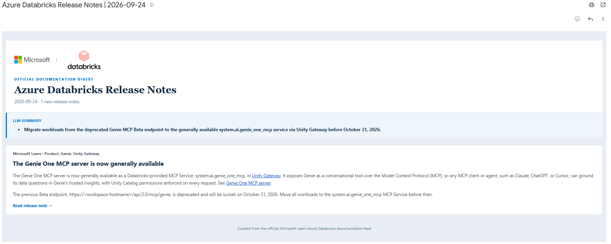

# Databricks Release Notes Digest

[](https://github.com/MixKlim/databricks-digest/actions/workflows/databricks.yml)
[](https://raw.githubusercontent.com/mixklim/databricks-digest/main/reports/coverage/index.html)



Scheduled Databricks Asset Bundle that reads the official [Azure Databricks release-notes RSS feed](https://learn.microsoft.com/en-us/azure/databricks/feed.xml) and sends cutting edge release notes via email. Microsoft documents this feed on the [Azure Databricks release-notes page](https://learn.microsoft.com/en-us/azure/databricks/release-notes/).

## Databricks setup

1. Create a Unity Catalog schema for the state table. The defaults are catalog `workspace` and schema `default`; override them with bundle variables if needed.
2. Create a Databricks secret scope named `databricks-digest` and add these keys:
   - `recipient-email`: the Gmail address used to send and receive the digest.
   - `smtp-app-password`: a Gmail app password, not the normal account password.
   - `gemini-api-key`: the Gemini API key used for the optional LLM digest summary.
3. Install the Databricks CLI and authenticate to the workspace.
4. Authenticate with the configured Databricks CLI profile and deploy:

   ```text
   databricks bundle deploy -t dev -p <DATABRICKS_PROFILE>
   ```

The production bundle runs ETL job, `databricks-digest`, daily at 08:00 using the `Europe/Amsterdam` timezone. Each run fetches items currently returned by Microsoft Docs RSS Feed, merges the items into the Delta table, and emails new items that have not yet been delivered.

The job uses `<catalog>.<schema>.databricks_release_notes`. The table records the feed publication time, the first and most recent observation times, and the delivery timestamp. Feed `pubDate` is not used as a delivery gate, so future-dated items are eligible as soon as they appear. Repeated polls are idempotent by feed item ID, and failed email delivery leaves items pending for the next digest. The feed only retains a finite set of items, so fetch failures are still reported through Databricks job notifications.

The feed client uses the fixed Microsoft Learn HTTPS endpoint, a bounded 30-second timeout, a descriptive user agent, and validates every returned link before capturing it. The Delta capture table makes polling idempotent across runs and feed refreshes.

## Local checks

Install the development dependencies with UV, then run:

```text
uv sync --dev
uv run pre-commit run --all-files
uv run pytest
```

### Local digest

This fetches release notes from Microsoft Learn RSS Feed and can send the matching window through email without requiring PySpark.

```powershell
Copy-Item .env.example .env
# Edit .env and replace the placeholder values.
uv sync --dev
uv run python scripts/local_digest.py --start-date 2026-09-01 --dry-run
uv run python scripts/local_digest.py --start-date 2026-09-01 --end-date 2026-09-05
```

`--start-date` selects the first local publication date in `YYYY-MM-DD` format. `--end-date` is optional; when provided, notes published through that date are included. Without it, only the start date is selected. The first command prints matching notes without sending mail. The second sends the matching notes and does not update the Delta state table. Unit tests cover feed parsing, date filtering, URL validation, state deduplication, and email composition.

### LLM digest summary

The `summarize_digest` function in `src/databricks_digest.py` uses Gemini LLM to turn each release note into one short, professional, developer-focused bullet sentence. It emphasizes practical impact, compatibility or migration concerns, and concrete actions. The function is optional and does not change email delivery or the Delta state table.

For the Databricks job, store the key in the configured secret scope as `gemini-api-key`. Local runs can use `GEMINI_API_KEY` in `.env` instead. The deployed job installs the `google-genai` dependency automatically; if Gemini is unavailable, the email is still sent without the LLM summary.

### Manual Databricks digest

To test the actual Spark/Delta merge and secret-scope path, deploy the development target and start the job manually:

```powershell
databricks bundle deploy -t dev -p <DATABRICKS_PROFILE>
databricks bundle run -t dev -p <DATABRICKS_PROFILE> databricks_digest
```

Check the run output and the recipient inbox. A second run with no new release notes should report `No new Azure Databricks release notes found; no email sent.`

## GitHub Actions

Configure the `production` environment with:

- Repository/environment variable `DATABRICKS_HOST`.
- Repository/environment secret `DATABRICKS_TOKEN` for the Databricks service principal.
- Repository/environment secret `DATABRICKS_PRINCIPAL_NAME` for the Databricks service principal.

The workflow validates on pull requests and deploys the `prod` bundle after a push to `main`.
